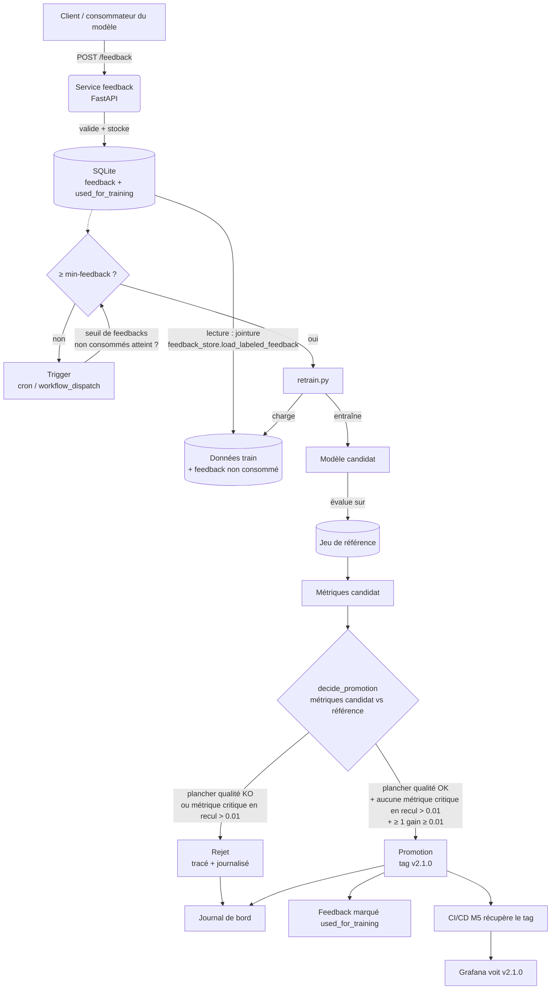

# M6-B2 — Implémenter la boucle de rétroaction complète (Pyrenex, binôme)

> **Repo template.** Un binôme fait **« Use this template »** →
> `M6-B2-pyrenex-boucle-<binome>` et invite l'autre membre en collaborateur.
> Vous restez avec le binôme de M6-B1 : vous continuez sur votre diagnostic.

## 🚀 Démarrage

```bash
python -m venv .venv && source .venv/bin/activate
pip install -r requirements.txt
pytest -q tests                                   # vert dès le clone ; se durcit avec vos TODO
python scripts/retrain.py --min-feedback 200      # une fois retrain.py complété
```

> Variante `uv` : `uv venv .venv && source .venv/bin/activate` puis
> `uv pip install -r requirements.txt`.
> Dépannage : `No module named pip` → vous êtes dans un venv créé par `uv`,
> utilisez `uv pip install …` (pas `pip install`).

Données fournies : `data/feedbacks_simules.csv` (200 à injecter), `prod_scored.csv`,
`lending_club_train.csv`, `reference_set.csv`. Modèle de base : `models/pyrenex_risk_v2.joblib`.

> ⚠️ **Premier geste : trancher le jeu de référence.** Le `data/reference_set.csv`
> livré ici fait **1500 lignes (17,5 % de défauts)** — ce n'est **pas** celui de
> votre M5-B2 (500 lignes). Or le plancher de votre politique de promotion vient
> de vos **seuils M5-B2**, calibrés sur *votre* jeu. Par défaut : **remplacez ce
> fichier par le vôtre**. Sinon, regelez le golden run et refaites le bootstrap.
> Décision + raison dans `decisions.md` (section « Jeu de référence retenu »).

## 🧭 Ce que vous construisez

Vous construisez **la boucle entière**, à deux. Répartissez-vous les briques,
mais **switchez à mi-parcours** : à la fin, chacun doit avoir écrit la partie
qui compte — la **décision de promotion**. En soutenance de certification, vous
serez seul·e à expliquer cette boucle.

| Brique | À faire | Fichier | Mini-cours |
|---|---|---|---|
| A — Endpoint | `POST /feedback` : valide, stocke, 404 / 409 / idempotent | `services/feedback/` | `01` |
| B — Stockage | SQLite + `used_for_training` + jointure `request_id` | (idem) | `02` |
| C — Réentraînement | `retrain.py` : données → **candidat** → évaluation | `scripts/retrain_TEMPLATE.py` | `04` |
| D — **Promotion** | `decide_promotion()` : la règle qui autorise le déploiement | `scripts/promotion_TEMPLATE.py` | `04`, `05` |
| E — Trigger + CI | cron / `workflow_dispatch`, garde-seuil | `crontab_TEMPLATE.txt`, `.github/workflows/ci.yml` | `03` |

> ⚠️ **Deux questions distinctes.** Le **trigger** répond à *« pourquoi
> réentraîner ? »*. La **promotion** répond à *« pourquoi déployer ? »*. Un
> réentraînement déclenché n'implique aucune mise en production : rejeter un
> candidat est une issue normale, tracée et défendable.

> Contrats d'interface, seuils et politique de promotion : à figer dans
> `decisions_TEMPLATE.md` **avant** de coder.

### 🔁 Cycle feedback → retrain → promotion



## ✅ Réussite

- `/feedback` accepte ≥ 200 annotations ; `request_id` inconnu → 404 ;
  feedback contradictoire → 409 ; rejeu à l'identique → sans doublon.
- Réentraînement **sur seuil de feedbacks non consommés** (199 → rien, 200 → trigger).
- Le **candidat** est écrit séparément ; `v2.1.0` n'existe **que** s'il est promu.
- La décision est une **fonction testée sur métriques mockées** (un cas promu,
  un cas rejeté), et chaque exécution est **journalisée**.
- Chaîne CI/CD M5 récupère le tag → Grafana voit v2.1.0.
- **Les deux membres** ont contribué, switch des rôles visible, **journal de bord**.
- Vous savez **défendre votre politique** — mardi, on confronte celles de tous
  les binômes, et vous n'aurez pas tous le même verdict.

## 📚 Ressources

Voir [`./ressources/`](./ressources/) — 5 mini-cours + `liens_officiels.md`.

## 🛠️ Implémentation réalisée

Ce qui suit décrit l'état réel de la boucle telle qu'implémentée dans ce
dépôt (au-delà du template ci-dessus).

### Jeu de référence

Le `data/reference_set.csv` livré a été remplacé par le jeu de référence de
500 lignes (≈ 18,4 % de défauts) hérité du M5-B2, figé et versionné dans
`data/reference_baseline.json` (métriques de référence pour `v2.0.0`). Choix
et justification consignés dans `decisions.md` (section « Jeu de référence
retenu »). Construit par [`scripts/build_reference_set.py`](scripts/build_reference_set.py)
(échantillonnage stratifié, `random_state=42`).

### A/B — Endpoint feedback + stockage

[`services/feedback/app/main.py`](services/feedback/app/main.py) expose :
- `POST /feedback` : valide `request_id` / `true_label` (0 ou 1) via Pydantic,
  404 si `request_id` inconnu (absent de `data/prod_scored.csv`), 409 en cas de
  feedback contradictoire (même `request_id`, label différent), idempotent
  (rejeu à l'identique → 201 sans doublon).
- `GET /feedback/count` : nombre total et nombre de feedbacks non consommés.
- `GET /mock-feedback?feedNumber=N` : injection incrémentale de feedbacks
  simulés pour les tests/démos.

Stockage SQLite (table `feedbacks` : `request_id` clé primaire, `true_label`,
`comments`, `created_at`, `used_for_training` par défaut à 0). La jointure
feedback ⋈ scoring (`request_id`) est gérée par
[`scripts/feedback_store.py`](scripts/feedback_store.py)
(`load_labeled_feedback`, `mark_used_for_training`, `inject_mock_feedback`).

### C — Réentraînement (`scripts/retrain.py`)

[`scripts/retrain.py`](scripts/retrain.py) : charge les feedbacks non
consommés, ne déclenche l'entraînement que si leur nombre atteint
`--min-feedback` (200 par défaut, sinon sortie en succès sans rien faire),
construit le jeu d'entraînement (données d'origine + feedbacks labellisés),
entraîne un `RandomForestClassifier` (pipeline avec le préprocesseur
existant), sauvegarde le candidat (`pyrenex_risk_candidate.joblib`), puis
évalue candidat et production sur le même jeu de référence figé
(`data/reference_set.csv`).

### D — Politique de promotion (`scripts/promotion.py`)

`decide_promotion()` implémente la règle explicite :
- **Plancher de qualité** : le candidat doit respecter `f1_macro ≥ 0.55`,
  `f1_default ≥ 0.35`, `roc_auc ≥ 0.65`, `recall_default ≥ 0.50`.
- **Métriques critiques** : `f1_macro` et `recall_default`. Justification : un
  faux négatif (défaut non détecté) a un coût métier direct (risque de
  crédit), et le jeu étant déséquilibré, une accuracy globale peut masquer un
  effondrement sur la classe minoritaire (défaut) — d'où l'usage du F1 macro
  en complément.
- **Non-régression** : rejet si une métrique critique recule de plus de
  `TOLERANCE = 0.01` par rapport à la production.
- **Gain minimum** : promotion seulement si, en plus, au moins une métrique
  progresse d'au moins `MIN_GAIN = 0.01`.

Chaque décision (motif inclus) est journalisée dans
[`decisions_log.jsonl`](decisions_log.jsonl), qu'elle soit une promotion ou un
rejet. En cas de promotion, le modèle est écrit dans
`services/model/models/pyrenex_risk_v2_1.joblib`/`.json` et les feedbacks
utilisés sont marqués `used_for_training`.

### E — Trigger + CI

Déclenchement automatique via [`crontab.txt`](crontab.txt) : vérification
toutes les 6h (`0 */6 * * *`), appel de `retrain.py --min-feedback 200`.
Déclenchement manuel possible via `workflow_dispatch` sur le workflow CI, ou en
exécutant directement la commande en local.

### Tests

Voir [`tests/test_boucle.py`](tests/test_boucle.py) (endpoint feedback,
politique de promotion sur métriques mockées — cas promu et cas rejetés,
lecture des feedbacks non consommés depuis SQLite),
[`tests/test_feedback_store.py`](tests/test_feedback_store.py) (jointure,
marquage, injection mock) et [`tests/test_evaluation.py`](tests/test_evaluation.py)
(calcul et vérification des métriques). Les tests de décision de promotion
n'exécutent jamais d'entraînement réel : ils manipulent des dictionnaires de
métriques.

Complétés par [`tests/test_preprocess.py`](tests/test_preprocess.py)
(chargement/mapping de la cible, colonnes manquantes, préprocesseur sans NaN
et robuste aux catégories inconnues), [`tests/test_build_reference_set.py`](tests/test_build_reference_set.py)
(échantillonnage stratifié, reproductibilité, holdout absent),
[`tests/test_bootstrap_noise.py`](tests/test_bootstrap_noise.py) (sigma des 4
métriques cibles), [`tests/test_generate_traffic.py`](tests/test_generate_traffic.py)
(construction des payloads, gestion des erreurs HTTP/réseau) et
[`tests/test_retrain.py`](tests/test_retrain.py) (construction du jeu
d'entraînement, entraînement/évaluation/validation du candidat, hash du
dataset, journalisation de la décision et des métadonnées promues) — le reste
du pipeline `retrain.py` non couvert par `test_boucle.py`.

⚠️ La CI (`.github/workflows/ci.yml`) n'exécute aujourd'hui que
`tests/test_evaluation.py` (job `evaluate-model`) et `services/model/tests`
(job `tests`) : `test_boucle.py`, `test_feedback_store.py` et les nouveaux
fichiers ci-dessus ne sont pas encore lancés automatiquement — `pytest -q
tests` reste donc nécessaire en local avant de pousser.

### Suivi / astreinte

La boucle (déclenchement, backlog de feedbacks, rejets de promotion,
incohérence tag/déploiement) est couverte par [`runbook.md`](runbook.md).

### Reste à faire

- Créer et pousser le tag git `v2.1.0` une fois une promotion validée (étape
  manuelle/CI, non automatisée par `retrain.py`) : la promotion a eu lieu
  (`decisions_log.jsonl`, 2026-09-09) et `services/model/models/pyrenex_risk_v2_1.joblib`/`.json`
  existent, mais aucun tag `v2.1.0` n'a encore été créé (`git tag --list` ne
  liste que `v0.0.1`, `v1.1.0-eval-continue-franck`, `v1.1.0-eval-continue-theo`).
